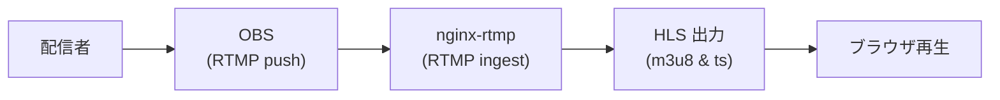

# nginx-rtmp Minimal Streaming Demo

## 概要
OBS から RTMP でプッシュした映像を nginx-rtmp で受け取り、HLS 形式（m3u8/ts）に変換してブラウザで再生するミニマム構成

## イメージ図



## 環境
- Docker / Docker Compose  
- nginx 1.18 + nginx-rtmp-module  
- OBS（ローカルから配信テスト）

## Quick Start

### イメージビルド
```sh
docker build -t my-rtmp .
```

### コンテナ起動
```sh
docker run -p 1935:1935 -p 8080:8080 my-rtmp
```

### OBS 設定
- 配信サーバ: `rtmp://localhost:8080/live`
- ストリームキー: `test`

### 再生確認
ブラウザで以下へアクセス

```
http://localhost:8080/hls/test.m3u8
```

Chrome / Edge / Firefox etc... はネイティブ再生できないため、HLSプレイヤーを利用する(拡張機能やhls.jsを使った簡易プレイヤー等)

## 補足
- HLS 出力先は `/tmp/hls`  
- コンテナ内部で確認する場合
    ```sh
    docker exec -it my-rtmp sh
    ls -l /tmp/hls
    ```
