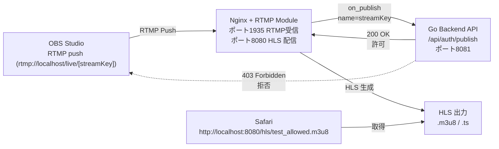

## 概要
**Go言語**で実装したバックエンドと**Nginx-RTMP**モジュールをDocker Composeで連携させ、**配信の認証・認可**機能を実装するライブストリーミングサービスの検証リポジトリ

OBS StudioなどからRTMPでプッシュされた映像をNginxが受け取り、Goバックエンドでストリームキーを検証した後、HLS形式（m3u8/ts）に変換してブラウザで再生するミニマム構成

-----

## 主な技術スタック

  * **Go**: 配信認証 API (HTTPサーバー)
  * **Nginx + Nginx-RTMP**: RTMP受信、HLS配信
  * **Docker / Docker Compose**: コンテナ生成

-----

## アーキテクチャ図


-----

## Quick Start

### 1\. 環境構築

`docker-compose.yml` を使用して、NginxコンテナとGoバックエンドコンテナを起動

```sh
# リポジトリルートで実行
docker compose up --build -d
```

### 2\. OBS Studio 設定

OBS Studioにて、以下の設定で配信を開始

| 設定項目 | 値 | 備考 |
| :--- | :--- | :--- |
| **配信サーバ** | `rtmp://localhost:1935/live` | NginxのRTMPインジェストポート |
| **ストリームキー** | `test_allowed` | Goバックエンドで認証が**成功**するキー |

> ⚠️ **認証テスト:** ストリームキーを `test_denied` などに設定して配信を試すと、Goバックエンド（ログ）で `403 Forbidden` となり、OBSの接続が拒否されることを確認できる

### 3\. 再生確認

認証が成功し、NginxがHLSファイルの生成を開始した後、ブラウザで以下のURLにアクセスすると、再生が可能

http://localhost:8080/hls/test_allowed.m3u8

> **Safariでの直接再生:** SafariなどHLSネイティブサポートブラウザでは、直接視聴できるが、他ブラウザ(HLSネイティブ未対応)からはHLS対応のプレイヤーから再生する

-----

## サービスとポート

| サービス | 役割 | 内部ポート | 公開ポート |
| :--- | :--- | :--- | :--- |
| `nginx` | RTMP受信、HLS配信 | `1935` (RTMP), `8080` (HTTP) | `1935`, `8080` |
| `go-backend` | 認証API (on\_publish処理) | `8081` (HTTP) | (なし) |

-----

## 認証フローの仕組み

1.  **OBS** がストリームキー（例: `test_allowed`）を付けて Nginx の RTMPポート (`1935`) にプッシュを開始。
2.  **Nginx** の `nginx.conf` に定義された `on_publish` ディレクティブがトリガーされる。
3.  Nginx は、内部ネットワーク経由で **`http://go-backend:8081/api/auth/publish?name=test_allowed`** へ認証リクエストを送信。
4.  **Goバックエンド** の `main.go` がリクエストを受け取り、`streamKey`（`name`パラメータ）を検証。
5.  Goバックエンドが `200 OK` を返すと、Nginxが配信を許可し、HLSファイルの生成を開始。`403 Forbidden` を返すと配信を拒否。
